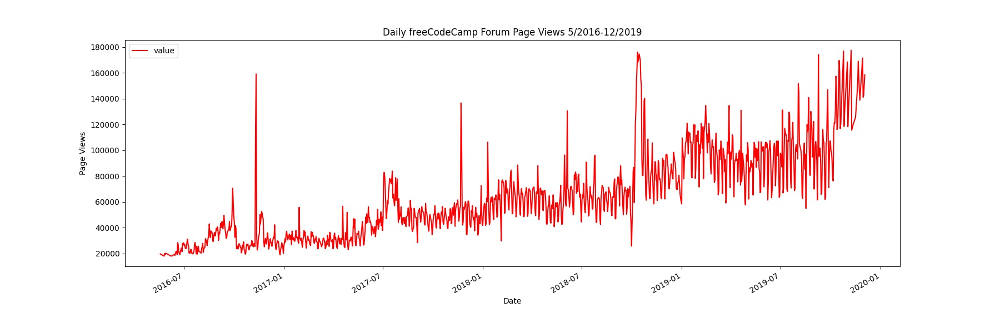
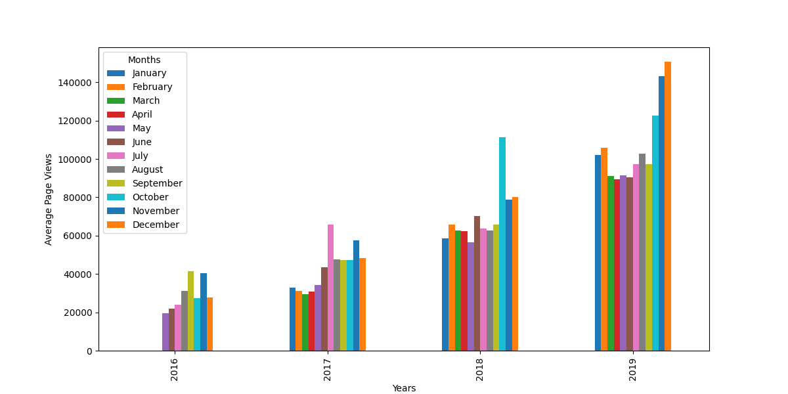
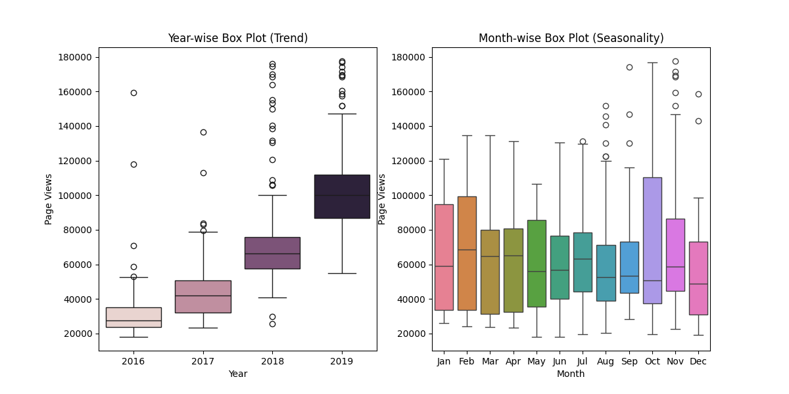

# Page View Time Series Visualizer
## Overview

This **python** project is the solution to this [FreeCodeCamp project](https://www.freecodecamp.org/learn/data-analysis-with-python/data-analysis-with-python-projects/page-view-time-series-visualizer).

 It was required to visualize time series data from the **FreeCodeCamp.org** forum, containing daily page views from **May 9, 2016, to December 3, 2019**.
Using **Matplotlib** and **Seaborn** libraries to visualize the data,
and  using **Pandas** library to analyze and clean the dataset.
The data is cleaned by filtering out extreme values (the top and bottom 2.5%) to focus on the core trends.

The goal is to analyze and visualize trends, growth patterns, and seasonal fluctuations in forum page views over time.


## Key Features

- **Data Import & Cleaning**: Using **Pandas** library n python to import,analyze and clean the dataset.
- **Line Chart**: Displays daily page views over time.
- **Bar Chart**: shows the average daily page views by month and year.
- **Box Plots**:Illustrates the distribution of page views on a yearly and monthly basis.

These visualizations help to understand the growth trends, seasonal variations, and other important insights from the forum’s page views data.

## Project Structure

The project directory contains the following files:

- `fcc-forum-pageviews.csv`: The dataset containing daily page views of the freeCodeCamp forum.
- `time_series_visualizer.py`: contains code to process the data and functions to generate the visualizations.
- `requirements.txt`: A list of required dependencies for the project.
- ` test_module.py`:contains the unit tests for this project. 
- ` main.py`: used to test the code. It contains imported tests from `test_module.py`,
  and functions call from `time_series_visualizer.py`.

## Available Functions
- draw_line_plot(): Creates a line plot to visualize the daily page views over time.
- draw_bar_plot(): Generates a bar chart showing the average daily page views for each month, grouped by year.
- draw_box_plot(): Creates two adjacent box plots showing the distribution of page views on a year-wise and month-wise basis.
The script will automatically save the generated plots to the root directory.

## Sample Visualizations
Below are the visualizations created by this project, illustrating key trends and insights from the data:

1. Line Plot: Daily freeCodeCamp Forum Page Views (5/2016 - 12/2019)
This line chart displays the daily page views over the specified period, highlighting overall trends and growth.


2. Bar Plot: Average Daily Page Views Grouped by Month and Year
This bar chart shows the average daily page views for each month, grouped by year. It provides a clear view of monthly fluctuations and annual trends.


3. Box Plot: Year-wise and Month-wise Distribution of Page Views
These box plots help visualize the distribution of page views both by year and by month, revealing any trends or seasonal variations in the data.


- Year-wise Box Plot (Trend)
This plot illustrates the distribution of page views for each year, providing insights into yearly trends and anomalies.


- Month-wise Box Plot (Seasonality)
This plot shows how page views are distributed by month, highlighting any seasonal variations in traffic.

## Installation

To run this project :
- Install the necessary dependencies:

```bash
pip install -r requirements.txt
```
- run main.py which will run the unit tests and generate the visualizations.
```bash
python main.py
```
